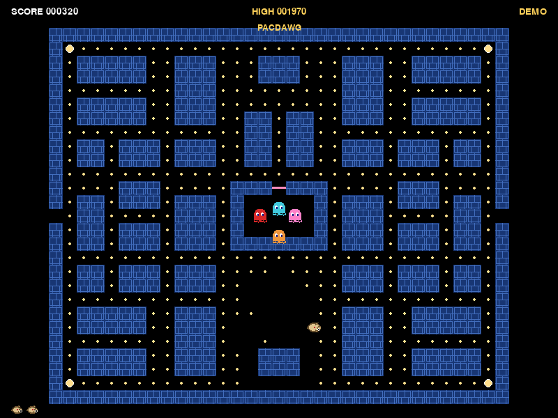

# PacDawg

An original, CMU-themed maze-chase arcade game starring **Scotty**, the
CMU mascot, versus four ghosts with genuinely different chase
personalities. Built for the CMU-Q arcade cabinet and its
[ArcadeLauncher](https://github.com/GDC-CMU/ArcadeLauncher).

This is not a Pac-Man clone with the serial numbers filed off: the
mazes, art direction, character, and ghost AI are all original, authored
for this project (see [Design notes](#design-notes) below). Maze-chase
as a genre is fair game; Bandai Namco's specific maze layout, sprites,
and name are not, and this project doesn't reproduce them.


## What it is

- A real, navigable **main menu** (Start Game / How to Play / Exit to
  Gallery), not just a "press start" splash -- shown on launch and again
  after every game over. See [Controls](#controls).
- A self-playing **attract-mode demo** after 15 seconds of idling on the
  menu -- the real maze, the real ghost AI, a simple self-playing Scotty
  -- see [Attract mode](#attract-mode).
- A dedicated **How to Play** screen covering arcade and keyboard
  controls, the ghost cast, scoring, and what power pellets do.
- A **Pause** menu with Resume selected by default and a deliberate
  Main Menu option. The entire run freezes until resumed.
- Three campus-themed original layouts (**The Cut**, **The
  Fence**, **Skibo**), cycling forever and speeding up as you go.
- Four ghosts with genuinely different targeting algorithms (not one
  rule recolored four times) -- see [Design notes](#design-notes).
- A **gentle first maze with automatic difficulty progression**: slower,
  staggered ghosts and longer power pellets at first, increasing after each
  cleared maze. See [Tuning difficulty](#tuning-difficulty).
- A proper scatter/chase/frightened state machine, power pellets, combo
  scoring for eating multiple ghosts in one frightened window, bonus
  fruit themed after the Skibo Cafe menu, lives, an extra life at
  10,000 points, and a persisted high score.
- **All gameplay art is swappable PNGs** -- see [Swapping in real
  art](#swapping-in-real-art).




## Controls

### Arcade cabinet

| Input | Action |
|---|---|
| Joystick (either connected stick), axis 0/1 | Steer Scotty / navigate the menu |
| Button 9 (Start) | Start a run / select the highlighted menu entry |
| Button 1 (A) | Wake the demo / visitor activity only; never starts or confirms |
| **Button 5 (P1) or Button 0 (B)** | **Pause / resume** during a run; back from help/results/demo; exit to the gallery only at the main menu |

The cabinet has two identical joystick devices; either one can steer, start,
or pause/resume.
Hot-plugging (disconnecting/reconnecting a stick mid-game) is handled
without crashing.

The main menu (shown on launch and again after every game over) is a
real, navigable menu -- **Start Game**, **How to Play**, **Exit to
Gallery** -- moved with axis 1 up/down (or arrows/WASD) and confirmed
with Start/Enter/Space, with the selected entry given a solid,
high-contrast highlight bar rather than a subtle tint so it reads from
several feet away. **Exit to Gallery** does exactly what P1 does at
the root menu. **How to Play** is a
full screen covering controls, the ghost cast, scoring, and power
pellets; P1/B/Esc/Backspace (or confirm) return to the menu.

### Keyboard (development)

| Input | Action |
|---|---|
| Arrow keys or WASD | Steer Scotty / navigate the menu |
| Enter / Space | Confirm / select |
| Esc or Backspace | Pause / resume or back -- same as P1/B on the cabinet |

### Pause, resume, and returning to the gallery

P1, B, Esc, and Backspace are equivalent. They never quit an active run
directly:

- **Main menu** -- back exits to the gallery (`sys.exit(0)`), since the
  menu is the top level with nothing above it.
- **Ready, playing, dying, or level clear** -- back opens **PAUSED**,
  with **Resume** selected. Start/Enter/Space selects; back resumes
  regardless of which choice is highlighted.
- **Paused** -- positions, pellets, score/lives, phase countdowns,
  fruit/frightened/release/mode timers, sprite animation, and gameplay RNG
  stay frozen. Resume continues the exact saved phase, without saving
  the score or resetting a countdown. Attract mode never runs here.
- **Main Menu in pause** -- deliberately abandons the run and commits
  the high score using the existing rules. It does **not** exit to the
  launcher. Selecting Start Game afterward creates a fresh run.
- **How to Play, game over, or demo** -- back returns to the main menu;
  Start/Enter/Space also returns from help/results.

Each transition consumes its input. Held Back cannot pause/resume/exit
repeatedly; held Start cannot dismiss help/results or activate the next
menu. Release before pressing again. Menu steering held when starting or
resuming must return to neutral before steering the game. The same guards
apply at process startup. Prompts follow the active keyboard or gamepad;
the help screen lists the aliases for that device.

## Attract mode

After `config.DEMO_IDLE_SECONDS` (15s, matched to the cabinet's other
games) of no genuine input on the main menu, PacDawg drops into a
self-playing demo rather than sitting on a static screen -- the real
maze, the real ghost AI (scatter/chase, Cruise Elroy, ghost-house
release, frightened, the works), and a demo Scotty steered by a
deliberately simple controller (`pacdawg.demo_ai`): seek the nearest
pellet, steer away from any ghost that's gotten close. It reuses
`Game`'s actual per-frame systems -- the same pellet/fruit/collision
handling real play uses -- rather than a separate faked-up simulation,
so the demo can never drift out of sync with the real game. A small
pulsing "DEMO" tag and the PACDAWG title overlay the HUD so it's
unmistakably a demo, not a stuck game, and the high score keeps
showing throughout.

**Any genuine input** -- a button, a key, or stick movement past the
configured deadzone -- ends the demo immediately and returns to the
main menu; a drifting/noisy stick at rest does not count, so a dirty
cabinet stick can't prevent attract mode from ever starting. The idle
timer re-arms every time the menu is (re)entered, from anywhere,
including right after a demo ends. P1/Esc/B/Backspace return from demo
directly to the menu, never to pause. Start, A, and steering also wake
the demo, but that wake-up input is consumed before menu activation.
Holding A keeps the menu awake without starting a run.

The demo cannot touch real game state. `Game._enter_demo()` saves the
real `ScoreBoard` aside untouched and swaps in a disposable one (seeded
with the same high score, purely for display) that is never committed
-- so the demo can never write the real high score -- and restores the
real one exactly as it was the moment the demo ends. If the demo
Scotty is caught, or the demo maze is somehow cleared, the demo simply
restarts from a fresh level rather than draining lives into a
game-over or advancing forever, so a long-running demo stays bounded.

## Launcher gallery preview

`assets/preview/` is a small, pre-rendered looping animation the
ArcadeLauncher's own gallery attract mode plays *inside this game's
card* when the cabinet idles -- a cross-repo contract, since the
launcher runs games as separate processes and can't drive another
game's loop itself. It contains:

```
assets/preview/manifest.json     {"version": 1, "fps": 8, "frames": [...]}
assets/preview/frame_000.png
assets/preview/frame_001.png
...
```

Frames are small (200x150 -- the launcher scales up with
nearest-neighbour, so pixel art stays crisp) and few (a 1-3 second
loop). The launcher never writes into a game's checkout and treats a
missing or malformed preview as a harmless fallback to procedural
card art, never a crash.

Regenerate it with:

```
python tools/generate_preview.py
```

The generator drives PacDawg's actual attract-mode demo headlessly
through the real render path (`render.draw_frame`) -- the same systems
described above, not a separate faked-up scene -- captures a handful
of frames at a chosen moment where the ghosts are visibly hunting
nearby, and downsamples them to card size. The DEMO tag and PACDAWG
title overlay are deliberately suppressed for these captures (see
`_render_clean_frame` in the tool): they're useful in-game context but
redundant clutter inside a card that already names the game.

It's fully deterministic -- rerunning it leaves `git status` clean --
via a fixed RNG seed and a fixed simulated frame delta (never real
elapsed time). `Game.update()` advances the game's sprite clock, so
walk-cycle animation timing can't vary between runs either. The manifest lists the captured frames forward
then backward (a "ping-pong" sequence) rather than looping straight
back to frame 0, so the loop never jump-cuts: since the demo is
continuously moving, every step in that sequence -- including the
wrap from the last entry back to the first -- is a real, adjacent pair
from the same continuous capture.

## Running locally

Requires Python 3.10+ and `pygame-ce`.

```
pip install -r requirements.txt
python main.py
```

The game runs **fullscreen** by default, which is how the cabinet is played.
It always renders at a logical 800x600 and lets SDL scale that onto whatever
panel is fitted, so any laptop resolution works. To run in a window instead
(much easier while developing):

```
# Windows PowerShell
$env:PACDAWG_WINDOWED = "1"; python main.py

# bash
PACDAWG_WINDOWED=1 python main.py
```

To run headlessly (no display, e.g. in CI or over SSH):

```
# Windows PowerShell
$env:SDL_VIDEODRIVER = "dummy"; python main.py

# bash
SDL_VIDEODRIVER=dummy python main.py
```

## Running the tests

The whole game is unit-tested headlessly, with no real display or
hardware required:

```
python -m unittest discover -s tests -v
```

Coverage includes maze parsing and validation (including malformed
layouts being rejected loudly), each ghost personality picking a
different target from identical game state, the scatter/chase/frightened
state machine, scoring and the ghost-eating combo, pellet accounting and
level completion, asset fallback behavior, working-directory
independence, and the arcade contract (800x600 display, deliberate root
exit, exact pause/RNG preservation in all active phases, Start-only
confirmation, both controllers, and held-input transition guards).

## How it's deployed

The [ArcadeLauncher](https://github.com/GDC-CMU/ArcadeLauncher) spawns
each game as `[sys.executable, "main.py"]` with `cwd` set to this
checkout, in its own virtualenv built from `requirements.txt`. That's why
`main.py` lives at the repo root with no arguments, and why every asset
and maze path is resolved from `__file__` rather than the current
working directory -- the game has to work no matter where the launcher
runs it from.

P1 (and Esc/B/Backspace) pause/resume active runs, return from
help/results/demo, and exit via `sys.exit(0)` only at the main menu.
That means the launcher's
documented "reclaim control" path is still exactly `sys.exit(0)` from
the main menu; it's just no longer one press away from every state, by
design (see "Pause, resume, and returning to the gallery" above).

The gallery is left with its own select button (button 1/A, or Enter)
still physically held down -- that's how the visitor picked PacDawg --
and our process can see that held state the instant we open the
joystick/keyboard. `Game.init_display()` flushes any queued startup
events and then seeds our pressed-button/key tracking directly from live
hardware state, including Start/9, so an already-held control must be released once before
it can register as a fresh press; a short settle window
(`config.INPUT_SETTLE_SECONDS`) additionally ignores menu confirm for a
moment at startup as a second layer of defense. None of this ever
delays or suppresses the back-one-level path, which stays an immediate,
level-triggered check once armed -- it only guards against a control
that happens to already be held at process start being misread as an
instant, unwanted level change.

## Swapping in real art

The client's brief was explicit: gameplay art must come from PNG files,
not code, so it's trivial to hand real assets to an artist later. See
[`assets/README.md`](assets/README.md) for the full sprite reference --
every expected file, its nominal size, and what it's used for. The short
version: **overwrite a file in `assets/sprites/` with the same name and
you're done, no code changes required.** Scotty's rounded closed/open mouth
originals are also supplied in `assets/artwork/`. To derive all four directions
and the life icon from those two files without touching other art, run:

```
python tools/generate_placeholders.py --scotty-only
```

## Tuning difficulty

Every tunable knob -- speeds, scatter/chase timing, frightened duration,
ghost house release timing, scoring, the extra-life threshold, fruit
thresholds -- lives in one place: [`pacdawg/config.py`](pacdawg/config.py).
`DIFFICULTY_BY_LEVEL` contains ten stages; clearing a maze advances one stage.
Losing a life or pausing does not change the stage. A new game starts at level
1, and level 10's limits remain in force when the maze layouts repeat.

| Level | Scotty speed | Ghost speed | Power-pellet duration |
|---|---|---|---|
| 1 | 75% | 45% | 12 seconds |
| 2 | 78% | 52% | 11 seconds |
| 3 | 81% | 59% | 10 seconds |
| 4 | 84% | 66% | 9 seconds |
| 5 | 86% | 73% | 8 seconds |
| 6 | 88% | 79% | 7 seconds |
| 7 | 90% | 84% | 6 seconds |
| 8 | 90% | 88% | 5 seconds |
| 9 | 90% | 92% | 4 seconds |
| 10+ | 90% | 95% | 3 seconds |

Percentages use the existing 9.4697-tiles/second reference scale. Ghost releases
are also staggered more generously in the early mazes. Even Gates' end-of-maze
speed-up stays below Scotty's normal speed on level 1. Power pellets retain a
short useful window on late levels instead of unexpectedly stopping working.

### Reference mechanics and deliberate difficulty choices

The live difficulty curve above is a deliberate cabinet design choice, not a
claim to reproduce the original ROM's difficulty. Reference data from Jamey
Pittman's *The Pac-Man Dossier* remains in `config.py` for the base speed,
scatter/chase schedules, original thresholds, and non-threatening eyes/house
movement. The ghost personalities, cornering advantage, scoring, revived-ghost
dwell, and chase-on-exit behavior remain intact. Dot thresholds are scaled to
our actual maze sizes.

Scotty's controls follow the documented cornering/pre-turn model rather
than a timed input buffer: a held direction is re-evaluated every frame
against Scotty's current tile and takes effect immediately, wherever
inside the tile he is, and he drifts diagonally toward a new lane's
centerline while cornering. Ghosts do not get this treatment -- they may
only change direction on an exact tile center -- which is the documented
mechanical basis of the player's speed advantage over them.

## Architecture

Pure game logic is kept separate from rendering so it's fully testable
without a display:

```
main.py                  entrypoint (the launcher invokes this exact path)
pacdawg/
  config.py              every tunable in one place
  maze.py                tile grid, text-layout parsing, pellet accounting
  levels.py              the original CMU-themed layouts + per-level tuning
  entities.py            Scotty + tile-aligned movement, tunnels
  ghosts.py              four personalities + scatter/chase/frightened machine
  game.py                state machine: menu -> help -> ready -> play -> death; pause/resume
  demo_ai.py             the attract-mode demo's simple self-playing controller
  score.py               scoring, lives, extra life, high-score persistence
  input.py               joystick + keyboard intent resolution
  assets.py              the single point of PNG access (see assets/README.md)
  render.py              draws only from assets.py surfaces, plus HUD text
tools/generate_placeholders.py
tools/generate_preview.py    regenerates assets/preview/ (see Launcher gallery preview)
tests/
docs/screenshots/
assets/preview/               launcher gallery card animation (see Launcher gallery preview)
```

Only `game.py`, `render.py`, and `assets.py` import `pygame`; every other
module is plain Python so it can be driven and asserted against directly
in tests.

## Design notes

### The four ghosts

Named after CMU campus landmarks, each with a genuinely different
targeting algorithm (see `pacdawg/ghosts.py`):

- **Gates** -- a direct chaser. Always targets Scotty's exact tile.
- **Hunt** -- an ambusher. Targets four tiles *ahead* of wherever Scotty
  is facing, trying to cut him off before he arrives -- including the
  documented "facing up" quirk (see below).
- **Wean** -- a flanker. Its target is Gates' position reflected through
  a point ahead of Scotty, so it swings in from an angle that depends on
  where Gates currently is.
- **Doherty** -- shy. Chases aggressively from eight tiles or more away,
  but flees back toward its home corner once it gets closer, so it never
  quite commits to the kill alone. Once low on remaining pellets, Gates
  enters "Cruise Elroy" mode: it speeds up in two stages and starts
  targeting Scotty directly even during scatter.

Hunt and Wean deliberately reproduce a documented original-game ROM bug:
targeting "N tiles in the direction Scotty is facing" overflows when
facing up, becoming "N tiles up **and** N tiles left" instead of just up.
This is a genuine artifact of how the original computed the offset (Don
Hodges' Z80 analysis), not an oversight here -- it's part of what makes
those two personalities beatable by facing up near them.

All four alternate between scatter (heading for a home corner) and chase
phases on a per-level timetable that pauses while any ghost is
frightened, turn frightened (and eventually flash a warning) after a
power pellet, and become eyes-only when eaten, racing back into the
house to their own home tile before rejoining the chase.

The documented Dossier timetable always opens each level with several
seconds of scatter before the first chase. On a real cabinet, where a
visitor plays for maybe 30-60 seconds, spending the first third of that
watching ghosts circle their corners with no threat reads as broken AI
rather than faithful pacing. `levels.py` keeps the full documented
timetable available (`documented_scatter_chase_timetable_for_level`,
still pinned by tests) but the game actually plays with
`scatter_chase_timetable_for_level`, which applies
`config.OPEN_IN_CHASE` to drop the opening scatter burst so ghosts
engage from the moment they leave the house; every phase after that
still runs for its documented duration. This is a deliberate,
club-fair deviation from the source material, not an authenticity bug --
set `config.OPEN_IN_CHASE = False` to restore the original opening.

Scatter corners are placed just outside the maze, in unreachable dead
space -- the same trick the original uses -- so a ghost patrols and
orbits its corner for the whole scatter phase instead of driving to it,
arriving, and parking there. Doherty's close-range retreat targets the
same unreachable corner, for the same reason. An eaten ghost dwells
visibly in the house for `config.GHOST_REVIVE_DWELL_SECONDS` (3 seconds
by default) after reaching its home tile before it's eligible to leave
again, rather than walking straight back out the door it just arrived
through.

### Mazes

Three original layouts -- **The Cut**, **The Fence**, **Skibo** -- named
after CMU landmarks, authored as plain text grids in `pacdawg/levels.py`
and validated at load time (every pellet must be reachable, exactly one
player start, a well-formed tunnel, etc.). Levels cycle through them
forever, getting faster each time.
