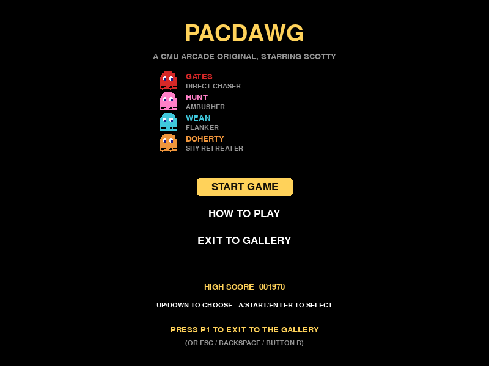
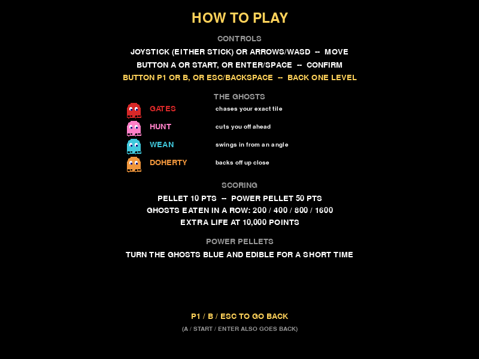
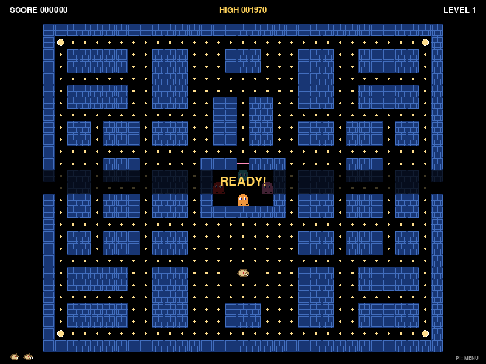
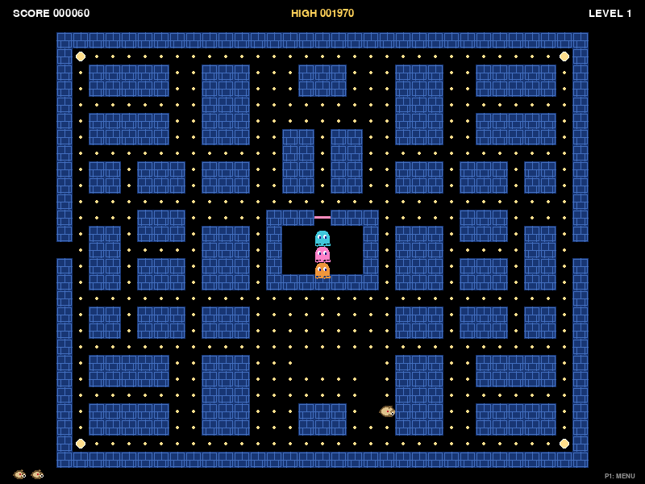
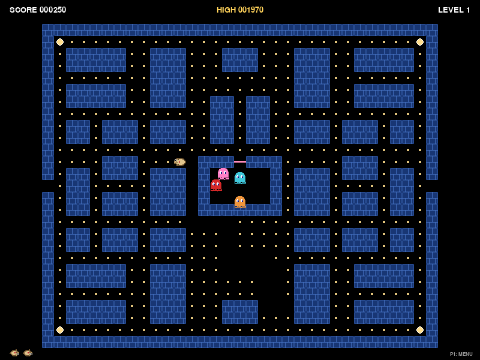
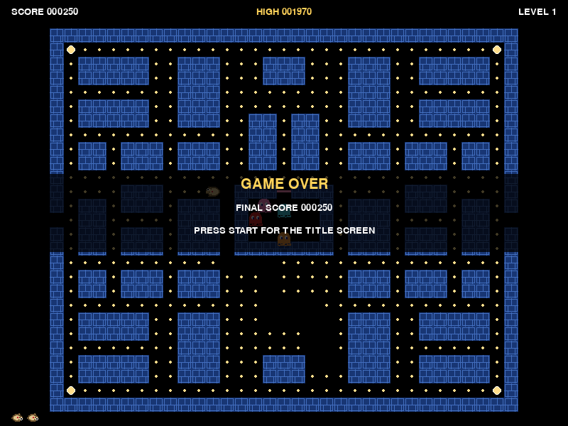

# PacDawg

An original, CMU-themed maze-chase arcade game starring **Scotty**, the
CMU mascot, versus four ghosts with genuinely different chase
personalities. Built for the CMU-Q arcade cabinet and its
[ArcadeLauncher](https://github.com/GDC-CMU/ArcadeLauncher).

This is not a Pac-Man clone with the serial numbers filed off: the
mazes, art direction, character, and ghost AI are all original, authored
for this project (see [Design notes](#design-notes) below). Maze-chase
as a genre is fair game; Bandai Namco's specific maze layout, sprites,
and name are not, and this project doesn't reproduce them.



## What it is

- A real, navigable **main menu** (Start Game / How to Play / Exit to
  Gallery), not just a "press start" splash -- shown on launch and again
  after every game over. See [Controls](#controls).
- A dedicated **How to Play** screen covering arcade and keyboard
  controls, the ghost cast, scoring, and what power pellets do.
- Four campus-themed mazes-worth of original layouts (**The Cut**, **The
  Fence**, **Skibo**), cycling forever and speeding up as you go.
- Four ghosts with genuinely different targeting algorithms (not one
  rule recolored four times) -- see [Design notes](#design-notes).
- Movement speeds, per-level timing, scatter/chase/frightened durations,
  Cruise Elroy, and ghost-house release logic are transcribed from
  documented Pac-Man (1980) ROM-derived data, scaled to our maze size --
  see [Difficulty is documented, not invented](#difficulty-is-documented-not-invented).
- A proper scatter/chase/frightened state machine, power pellets, combo
  scoring for eating multiple ghosts in one frightened window, bonus
  fruit themed after the Skibo Cafe menu, lives, an extra life at
  10,000 points, and a persisted high score.
- **All gameplay art is swappable PNGs** -- see [Swapping in real
  art](#swapping-in-real-art).











## Controls

### Arcade cabinet

| Input | Action |
|---|---|
| Joystick (either connected stick), axis 0/1 | Steer Scotty / navigate the menu |
| Button 1 (A) or Button 9 (Start) | Confirm / select the highlighted menu entry |
| **Button 5 (P1) or Button 0 (B)** | **Back one level** -- main menu -> exit to the gallery; anywhere else -> main menu |

The cabinet has two identical joystick devices; either one can steer.
Hot-plugging (disconnecting/reconnecting a stick mid-game) is handled
without crashing.

The main menu (shown on launch and again after every game over) is a
real, navigable menu -- **Start Game**, **How to Play**, **Exit to
Gallery** -- moved with axis 1 up/down (or arrows/WASD) and confirmed
with A/Start/Enter/Space, with the selected entry given a solid,
high-contrast highlight bar rather than a subtle tint so it reads from
several feet away. It's also the one place that tells a visitor P1
exits to the launcher's gallery, since the gallery itself doesn't say
so. **Exit to Gallery** does exactly what P1 does. **How to Play** is a
full screen covering controls, the ghost cast, scoring, and power
pellets; P1/B/Esc/Backspace (or confirm) return to the menu.

### Keyboard (development)

| Input | Action |
|---|---|
| Arrow keys or WASD | Steer Scotty / navigate the menu |
| Enter / Space | Confirm / select |
| Esc or Backspace | Back one level -- same as P1/B on the cabinet |

### P1 goes back one level, everywhere

This is a cross-game convention for the club's arcade cabinet, not a
PacDawg-specific quirk: **P1 always means "go back one level," never
"quit immediately."** Esc and Backspace on the keyboard, and button B
(0) on the cabinet, are exactly equivalent aliases of that same single
action -- all four controls do the same thing on every screen:

- **Main menu** -- back exits to the gallery (`sys.exit(0)`), since the
  menu is the top level with nothing above it.
- **Every other screen** -- HOW TO PLAY, or any state of a game in
  progress -- back returns to the main menu. A game in progress is
  treated as abandoned: the high score is committed so nothing earned
  is lost, and starting again always begins a genuinely fresh game.

So leaving from mid-game takes two presses (back to the menu, then back
again to exit) rather than one. That's deliberate: it makes an
accidental press recoverable instead of instantly dumping a visitor out
of the game. A visitor mid-game gets a small, quiet "P1: MENU" reminder
tucked in the HUD's corner, since the title screen's legend is no
longer on screen at that point.

A held P1/Esc/B/Backspace can't chain two level changes in a row --
e.g. holding it to leave gameplay can't also be read as a fresh press
the instant the menu appears, which would otherwise dump a visitor
straight out of the game on a single hold. See
`Game.maybe_go_back()`'s armed/disarmed latch (tracked against the raw
physical signal, not against what it currently does) for how that's
guarded, on top of the same startup input-residue protection described
below. No reachable state can trap a visitor: repeated back presses
from anywhere always reach process exit in at most two presses.

## Running locally

Requires Python 3.10+ and `pygame-ce`.

```
pip install -r requirements.txt
python main.py
```

To run headlessly (no display, e.g. in CI or over SSH):

```
# Windows PowerShell
$env:SDL_VIDEODRIVER = "dummy"; python main.py

# bash
SDL_VIDEODRIVER=dummy python main.py
```

## Running the tests

The whole game is unit-tested headlessly, with no real display or
hardware required:

```
python -m unittest discover -s tests -v
```

Coverage includes maze parsing and validation (including malformed
layouts being rejected loudly), each ghost personality picking a
different target from identical game state, the scatter/chase/frightened
state machine, scoring and the ghost-eating combo, pellet accounting and
level completion, asset fallback behavior, working-directory
independence, and the arcade back-one-level contract (800x600 display,
P1/Esc/B/Backspace always reach process exit within two presses from
any state).

## How it's deployed

The [ArcadeLauncher](https://github.com/GDC-CMU/ArcadeLauncher) spawns
each game as `[sys.executable, "main.py"]` with `cwd` set to this
checkout, in its own virtualenv built from `requirements.txt`. That's why
`main.py` lives at the repo root with no arguments, and why every asset
and maze path is resolved from `__file__` rather than the current
working directory -- the game has to work no matter where the launcher
runs it from.

P1 (and Esc/B/Backspace) always go back one level -- main menu exits
via `sys.exit(0)`, everywhere else returns to the main menu -- per this
club's cross-game arcade convention. That means the launcher's
documented "reclaim control" path is still exactly `sys.exit(0)` from
the main menu; it's just no longer one press away from every state, by
design (see "P1 goes back one level, everywhere" above).

The gallery is left with its own select button (button 1/A, or Enter)
still physically held down -- that's how the visitor picked PacDawg --
and our process can see that held state the instant we open the
joystick/keyboard. `Game.init_display()` flushes any queued startup
events and then seeds our pressed-button/key tracking directly from live
hardware state, so an already-held control must be released once before
it can register as a fresh press; a short settle window
(`config.INPUT_SETTLE_SECONDS`) additionally ignores menu confirm for a
moment at startup as a second layer of defense. None of this ever
delays or suppresses the back-one-level path, which stays an immediate,
level-triggered check once armed -- it only guards against a control
that happens to already be held at process start being misread as an
instant, unwanted level change.

## Swapping in real art

The client's brief was explicit: gameplay art must come from PNG files,
not code, so it's trivial to hand real assets to an artist later. See
[`assets/README.md`](assets/README.md) for the full sprite reference --
every expected file, its nominal size, and what it's used for. The short
version: **overwrite a file in `assets/sprites/` with the same name and
you're done, no code changes required.** Everything currently there is a
deterministically-generated placeholder (`tools/generate_placeholders.py`),
not final art.

## Tuning difficulty

Every tunable knob -- speeds, scatter/chase timing, frightened duration,
ghost house release timing, scoring, the extra-life threshold, fruit
thresholds -- lives in one place: [`pacdawg/config.py`](pacdawg/config.py).
Nothing else in the codebase hard-codes a difficulty number.

## Difficulty is documented, not invented

Every speed, timing, and threshold in `config.py` is transcribed from
Jamey Pittman's *The Pac-Man Dossier* (a ROM-disassembly-derived
reference), cross-checked against Don Hodges' Z80 analysis and two
high-fidelity open-source clones -- not estimated. The base speed
(9.4697 tiles/sec at 100%), per-level speed bands, scatter/chase
timetable (including the ~17-minute third chase and the pause while any
ghost is frightened), frightened duration/flash counts (including the
documented non-monotonic jumps at levels 6, 10, and 14), Cruise Elroy,
and the ghost-house release counters all carry a comment citing the
source. Every documented value that's expressed as an absolute dot count
(Elroy thresholds, ghost-house release counters, fruit triggers) is
scaled proportionally to our maze's actual pellet count, since our mazes
aren't the original's 244-dot 28x36 grid. A handful of values the Dossier
itself flags as undocumented (eaten-ghost "eyes" speed, in-house pacing
speed) follow the same estimates the reference clones use, noted in
`config.py` as such.

Scotty's controls follow the documented cornering/pre-turn model rather
than a timed input buffer: a held direction is re-evaluated every frame
against Scotty's current tile and takes effect immediately, wherever
inside the tile he is, and he drifts diagonally toward a new lane's
centerline while cornering. Ghosts do not get this treatment -- they may
only change direction on an exact tile center -- which is the documented
mechanical basis of the player's speed advantage over them.

## Architecture

Pure game logic is kept separate from rendering so it's fully testable
without a display:

```
main.py                  entrypoint (the launcher invokes this exact path)
pacdawg/
  config.py              every tunable in one place
  maze.py                tile grid, text-layout parsing, pellet accounting
  levels.py              the original CMU-themed layouts + per-level tuning
  entities.py            Scotty + tile-aligned movement, tunnels
  ghosts.py              four personalities + scatter/chase/frightened machine
  game.py                state machine: menu -> how to play -> ready -> play -> death -> ...
  score.py               scoring, lives, extra life, high-score persistence
  input.py               joystick + keyboard intent resolution
  assets.py              the single point of PNG access (see assets/README.md)
  render.py              draws only from assets.py surfaces, plus HUD text
tools/generate_placeholders.py
tests/
docs/screenshots/
```

Only `game.py`, `render.py`, and `assets.py` import `pygame`; every other
module is plain Python so it can be driven and asserted against directly
in tests.

## Design notes

### The four ghosts

Named after CMU campus landmarks, each with a genuinely different
targeting algorithm (see `pacdawg/ghosts.py`):

- **Gates** -- a direct chaser. Always targets Scotty's exact tile.
- **Hunt** -- an ambusher. Targets four tiles *ahead* of wherever Scotty
  is facing, trying to cut him off before he arrives -- including the
  documented "facing up" quirk (see below).
- **Wean** -- a flanker. Its target is Gates' position reflected through
  a point ahead of Scotty, so it swings in from an angle that depends on
  where Gates currently is.
- **Doherty** -- shy. Chases aggressively from eight tiles or more away,
  but flees back toward its home corner once it gets closer, so it never
  quite commits to the kill alone. Once low on remaining pellets, Gates
  enters "Cruise Elroy" mode: it speeds up in two stages and starts
  targeting Scotty directly even during scatter.

Hunt and Wean deliberately reproduce a documented original-game ROM bug:
targeting "N tiles in the direction Scotty is facing" overflows when
facing up, becoming "N tiles up **and** N tiles left" instead of just up.
This is a genuine artifact of how the original computed the offset (Don
Hodges' Z80 analysis), not an oversight here -- it's part of what makes
those two personalities beatable by facing up near them.

All four alternate between scatter (heading for a home corner) and chase
phases on a per-level timetable that pauses while any ghost is
frightened, turn frightened (and eventually flash a warning) after a
power pellet, and become eyes-only when eaten, racing back into the
house to their own home tile before rejoining the chase.

The documented Dossier timetable always opens each level with several
seconds of scatter before the first chase. On a real cabinet, where a
visitor plays for maybe 30-60 seconds, spending the first third of that
watching ghosts circle their corners with no threat reads as broken AI
rather than faithful pacing. `levels.py` keeps the full documented
timetable available (`documented_scatter_chase_timetable_for_level`,
still pinned by tests) but the game actually plays with
`scatter_chase_timetable_for_level`, which applies
`config.OPEN_IN_CHASE` to drop the opening scatter burst so ghosts
engage from the moment they leave the house; every phase after that
still runs for its documented duration. This is a deliberate,
club-fair deviation from the source material, not an authenticity bug --
set `config.OPEN_IN_CHASE = False` to restore the original opening.

Scatter corners are placed just outside the maze, in unreachable dead
space -- the same trick the original uses -- so a ghost patrols and
orbits its corner for the whole scatter phase instead of driving to it,
arriving, and parking there. Doherty's close-range retreat targets the
same unreachable corner, for the same reason. An eaten ghost dwells
visibly in the house for `config.GHOST_REVIVE_DWELL_SECONDS` (3 seconds
by default) after reaching its home tile before it's eligible to leave
again, rather than walking straight back out the door it just arrived
through.

### Mazes

Three original layouts -- **The Cut**, **The Fence**, **Skibo** -- named
after CMU landmarks, authored as plain text grids in `pacdawg/levels.py`
and validated at load time (every pellet must be reachable, exactly one
player start, a well-formed tunnel, etc.). Levels cycle through them
forever, getting faster each time.
